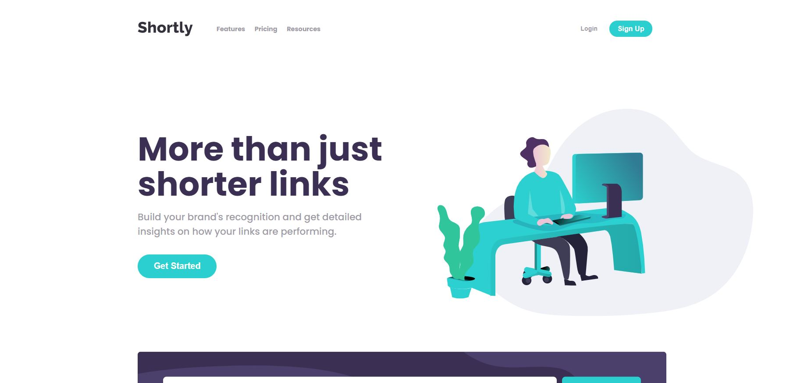

<h1 align="center">Countries Searching</h1>

 
 

# Project
 
This project is a challenge from [Front-end Mentor](https://www.frontendmentor.io/) website, its a link shortener app that consumes [Shortcode API](https://app.shrtco.de/)

# Technologies
- Angular
- RxJS
- SASS
- JEST

# Running project

This project was generated with [Angular CLI](https://github.com/angular/angular-cli) version 11.0.5.

## Development server

Run `ng serve` for a dev server. Navigate to `http://localhost:4200/`. The app will automatically reload if you change any of the source files.

## Build

Run `ng build` to build the project. The build artifacts will be stored in the `dist/` directory. Use the `--prod` flag for a production build.

## Running unit tests

Run `npm run test` to execute the unit tests via [Jest](https://jestjs.io/pt-BR/).

